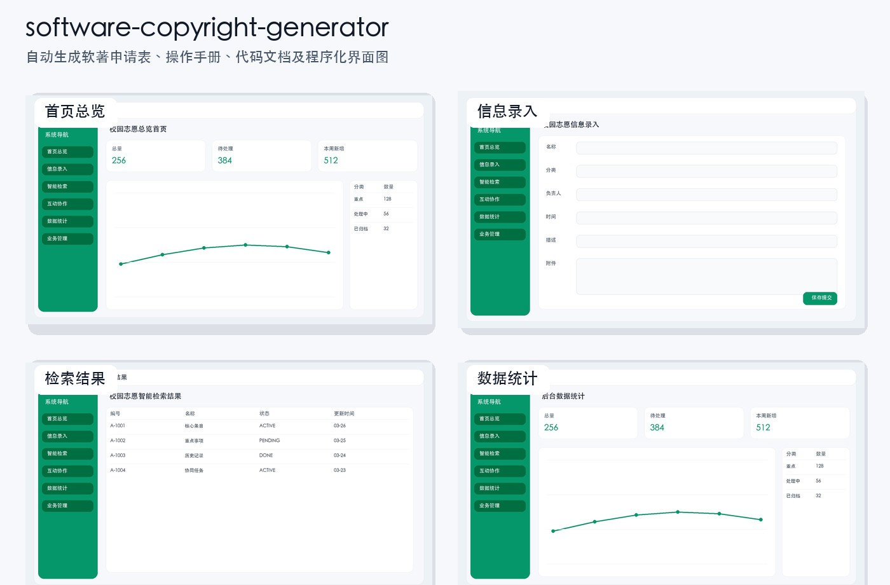

# software-copyright-generator

[](https://github.com/kinghy949/software-copyright-generator/actions/workflows/ci.yml)

一个用于生成软著申请三件套的 Codex Skill。



用户只需要提供：

- `系统全名`
- `系统简介`

即可自动生成一套固定模板风格的软著材料：

- `申请表.docx`
- `操作手册.docx`
- `代码文档.docx`
- `spec.json`
- `mockups/` 配图目录

这个 skill 主要面向常见 Web 系统场景，输出风格固定为 Java / Spring Boot / Vue 类项目文档。

## 快速开始

```powershell
git clone git@github.com:kinghy949/software-copyright-generator.git
cd software-copyright-generator
pip install -r requirements.txt

python ".\scripts\render_bundle.py" `
  --name "校园志愿服务管理平台" `
  --intro "这是一个面向高校的 Web 管理系统，支持志愿活动发布、报名审核、信息录入、查询统计、互动交流和后台管理。" `
  --output-dir ".\output"
```

默认会生成：

- `申请表.docx`
- `操作手册.docx`
- `代码文档.docx`
- `spec.json`
- `mockups/` 配图目录

## 功能特点

- 根据系统名称和简介自动扩展出申请表、说明书和代码文档内容
- 申请表 `开发目的` 限制在 50 字以内，`主要功能` 自动扩写到 500–1300 字
- 操作手册目录带缩进、点引线和页码；模块小节使用分级编号（`2.2.1.1`）和步骤编号（`（1）/（2）`）
- 申请表与操作手册全文统一为 **宋体 五号 黑色**
- 代码文档统一为 **Times New Roman + 宋体（中文）五号 黑色**
- 自动生成 16 张与操作手册章节对应的程序化界面图，兼容 macOS / Linux / Windows 中文字体
- 自动输出 3000+ 行（约 60 页以上）代码文档
- 自动统一软件名称、版本、功能描述和技术特点，减少三件套之间的文案冲突
- 内置软著常见规则摘要，便于后续审查风险说明

## 仓库定位

这个仓库适合：

- 快速生成固定模板风格的软著三件套草稿
- 为学校项目、课程项目、管理平台、信息系统准备申报材料初稿
- 在只有系统名称和简介的情况下快速成稿

这个仓库不负责：

- 官方在线正式填报
- 权利人身份证明、营业执照、委托书等主体材料
- 法律真实性校验
- 桌面端、嵌入式、游戏、复杂算法软件的高拟真源码生成

## 目录结构

```text
software-copyright-generator/
├── SKILL.md
├── README.md
├── agents/
│   └── openai.yaml
├── assets/
│   ├── showcase/
│   │   └── preview-collage.jpg
│   └── templates/
│       ├── template_application.docx
│       ├── template_manual.docx
│       └── template_code.docx
├── references/
│   └── requirements.md
└── scripts/
    ├── render_bundle.py
    ├── render_mockups.py
    └── template_rewriter.py
```

## 安装方式

如果你要把它作为 Codex Skill 使用，推荐直接放到 `~/.codex/skills/` 或 `%USERPROFILE%\\.codex\\skills\\` 下。

Windows 示例：

```powershell
git clone git@github.com:kinghy949/software-copyright-generator.git `
  "$env:USERPROFILE\\.codex\\skills\\software-copyright-generator"
```

如果你只是想单独调用脚本，也可以克隆到任意目录后直接运行 `scripts/render_bundle.py`。

## 作为 Skill 调用

### 在 Codex 中显式调用

在支持技能调用的 Codex 环境中，可直接使用：

```text
Use $software-copyright-generator 为“校园志愿服务管理平台”根据以下简介生成软著三件套：这是一个面向高校的 Web 管理系统，支持信息录入、查询统计、社区互动和后台管理。
```

### 安装到 Codex Skill 目录

```powershell
git clone git@github.com:kinghy949/software-copyright-generator.git `
  "$env:USERPROFILE\\.codex\\skills\\software-copyright-generator"
```

## 生成内容说明

### 申请表

- 按固定表格模板写入软件名称、版本、开发环境、运行环境、开发目的、主要功能、技术特点等字段

### 操作手册

- 保持固定的 6 个模块结构
- 自动生成目录、简介、业务流程和模块操作说明
- 自动插入 16 张程序化界面图

### 代码文档

- 按固定 Java / Vue 风格生成
- 自动扩展到 60 页以上
- 用于快速形成软著代码文档草稿

## 依赖环境

- Python 3.12+
- `python-docx`
- `Pillow`

跨平台说明：脚本会自动按顺序探测 Windows / macOS / Linux 常见中文字体（雅黑、宋体、PingFang、Noto CJK、文泉驿等），无需手动配置。

如果环境里没有这些包，可自行安装：

```powershell
pip install -r requirements.txt
```

## 校验

仓库中的 skill 结构可通过下列命令校验：

```powershell
$env:PYTHONUTF8='1'
python "C:\Users\PC\.codex\skills\.system\skill-creator\scripts\quick_validate.py" "."
```

生成链路的本地烟雾测试：

```powershell
python ".\scripts\smoke_test.py"
```

## 说明

这个项目输出的是“固定模板型软著材料生成器”，重点是速度和成稿率，不等同于官方申报系统，也不保证直接通过审查。正式提交前，仍建议人工检查：

- 软件名称是否统一
- 主要功能与系统实际是否一致
- 技术特点是否符合真实项目
- 代码文档是否需要替换为真实源码片段
